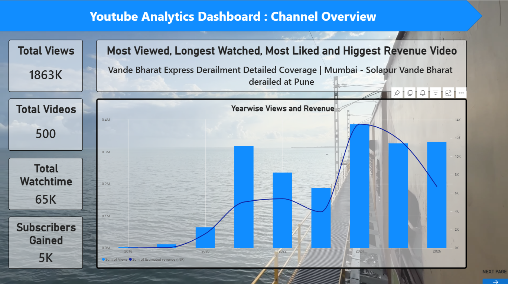
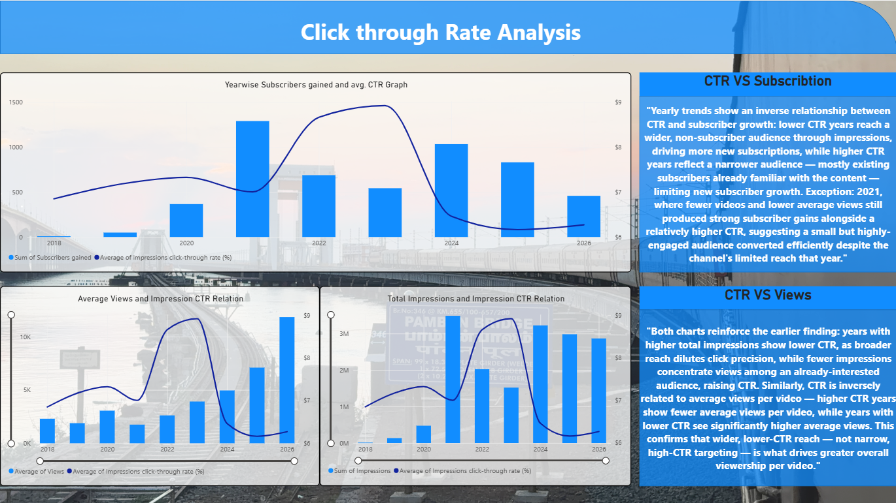
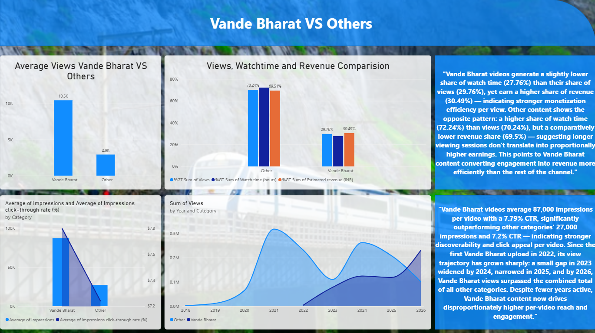

# YouTube Channel Analytics — CTR, Growth & Category Performance

An end-to-end data analytics project analyzing 500+ videos from the YouTube channel [@PushkarKhamitkar](https://www.youtube.com/@PushkarKhamitkar), investigating whether Click-Through Rate (CTR) reliably predicts subscriber growth and viewership, and comparing the performance of Vande Bharat Express–related content against all other content on the channel.

## Overview

The channel began in 2018 with railway electrification coverage and expanded into travel vlogging — trains, buses, and flights — including a brand collaboration with Fly91 Airlines. This project uses the channel's own performance data to answer practical growth questions: **does chasing a higher CTR actually grow a channel, or does wider reach matter more? And how does a newer content category (Vande Bharat, introduced in 2022) stack up against the rest of the channel's output?**

Each dashboard page below is framed around specific business questions, with the answer derived directly from the data.

## Tools & Skills Used

| Tool | Purpose |
|---|---|
| **Excel** | Data cleaning, column pruning, formula-based category tagging |
| **SQL** | Video categorization (`CASE WHEN`), aggregation, `GROUP BY` analysis |
| **Power BI** | Interactive dashboard design across 3 report pages |
| **DAX** | Calculated measures (`TOPN`, `CALCULATE`, `SELECTEDVALUE`) for top-performer cards |

**Core skills demonstrated:** Data Cleaning · Data Visualization · Statistical/Trend Analysis · Data Interpretation · KPI Reporting · Dashboard Design

---

## Page 1 — Channel Overview

**Business question:** What does the channel's performance look like at a glance, and which single video has been the strongest overall performer?

**Answer:** The channel has generated 1.86M total views across 500 videos, with 65K watch hours and 5K subscribers gained lifetime. One video — the Vande Bharat Express derailment coverage — simultaneously leads in views, watch time, likes, and revenue, making it the channel's single strongest asset. The year-wise trend shows steady growth from 2018, peaking around 2024.

---

## Page 2 — CTR Analysis

**Business question 1:** Does a higher Click-Through Rate lead to higher subscriber growth?
**Answer:** No — the relationship is inverse. Years with lower CTR and higher impressions reached a wider, non-subscriber audience and drove more new subscriptions, while high-CTR years mostly reflected an already-engaged, narrower audience with limited room to grow subscribers further. 2021 is a notable exception: fewer videos and lower reach still produced strong subscriber gains alongside a relatively higher CTR.

**Business question 2:** Does a higher CTR mean a video reaches more viewers on average?
**Answer:** No — CTR and average views per video are inversely related. Higher-CTR years show fewer average views per video, while lower-CTR years see significantly higher average views, confirming that CTR reflects click precision, not overall reach.

**Business question 3:** Does the volume of impressions affect CTR?
**Answer:** Yes — years with the highest total impressions consistently show the lowest CTR, since broader reach dilutes click precision, while fewer impressions concentrate views among an already-interested audience and raise CTR.

---

## Page 3 — Vande Bharat vs. Other Categories

**Business question 1:** Does Vande Bharat content outperform the rest of the channel on a per-video basis, despite being a newer category?
**Answer:** Yes — Vande Bharat videos average 10.5K views and 87,000 impressions per video at a 7.79% CTR, compared to 2.9K views, 27,000 impressions, and a 7.2% CTR for all other content combined, despite being introduced only in 2022 versus the channel's 2018 start.

**Business question 2:** Which category converts engagement into revenue more efficiently?
**Answer:** Vande Bharat does. It earns a higher share of revenue (30.49%) than its share of watch time (27.76%), while other content shows the reverse pattern — a higher watch time share (72.24%) than revenue share (69.5%) — meaning longer viewing sessions on other content don't translate into proportionally higher earnings.

**Business question 3:** Has Vande Bharat's growth trajectory caught up with the rest of the channel over time?
**Answer:** Yes, and it has overtaken it. Since the first upload in 2022, the views gap between Vande Bharat and other content narrowed year over year, and by 2026, cumulative Vande Bharat views surpassed the combined total of every other category on the channel.

---

## Data Source

Data was exported from YouTube Studio (Advanced Mode) at the video level, covering metrics including views, watch time, average view duration, average percentage viewed, impressions, impressions CTR, likes/dislikes, comments, subscribers gained/lost, and estimated revenue.

## Repository Contents

- `data/` — Cleaned dataset (Excel/CSV)
- `dashboard-images/` — Dashboard page screenshots
- `Youtube Dashboard.pbix` — Power BI dashboard file

## Author

**Pushkar Suresh Khamitkar**
[LinkedIn](https://www.linkedin.com/in/pushkar-khamitkar-2b4912276/) · [YouTube Channel](https://www.youtube.com/@PushkarKhamitkar)
